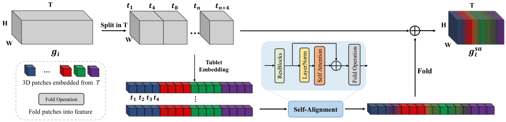

# Official Repo of TCNet

## Abstract

Video super-resolution (VSR) is a task that aims to reconstruct high-resolution (HR) frames from the low-resolution (LR) reference frame and multiple neighboring frames. The vital operation is to utilize the relative misaligned frames for the current frame reconstruction and preserve the consistency of the results. Existing methods generally explore information propagation and frame alignment to improve the performance of VSR. However, few studies focus on the temporal consistency of inter-frames. In this paper, we propose a Temporal Consistency learning Network (TCNet) for VSR in an end-to-end manner, to enhance the consistency of the reconstructed videos. A spatio-temporal stability module is designed to learn the self-alignment from inter-frames. Especially, the correlative matching is employed to exploit the spatial dependency from each frame to maintain structural stability. Moreover, a self-attention mechanism is utilized to learn the temporal correspondence to implement an adaptive warping operation for temporal consistency among multi-frames. Besides, a hybrid recurrent architecture is designed to leverage short-term and long-term information. We further present a progressive fusion module to perform a multistage fusion of spatio-temporal features. And the final reconstructed frames are refined by these fused features. Objective and subjective results of various experiments demonstrate that TCNet has superior performance on different benchmark datasets, compared to several state-of-the-art methods.

## Method

Pipeline of the proposed **Temporal Consistency Learning of inter-frames for Video Super-Resolution**

 

Architecture of the proposed **temporal consistency learning approach**

 

 

## Codes

We thank [Xintao](https://xinntao.github.io/) and his group for their open-sourced image/video processing ToolBox [**BasicSR**](https://github.com/XPixelGroup/BasicSR/). Our codes are totally based on it.

### Prerequisites

- Linux Ubuntu 18.04+
- Anaconda
- Python 3.7+
- Pytorch 1.7+

### DatasetsPreparation

- REDS
  
  1. Download the datasets from the [official website](https://seungjunnah.github.io/Datasets/reds.html).
  2. Regroup the training and validation datasets (following [EDVR](https://github.com/xinntao/EDVR)).
  3. Make LMDB files when necessary. Please refer to LMDB Description. 

- Vimeo90K
  1. Download the dataset: [Septuplets dataset](http://toflow.csail.mit.edu/) All GroundTruth images (82GB).
  2. Generate the low-resolution images. Refer to the scripts files for BI & BD degradation.
  3. Make LMDB files when necessary. Please refer to LMDB Description. 
   

### GetStarted

- Following **BasicSR** [illustration](https://github.com/XPixelGroup/BasicSR/blob/master/docs/INSTALL.md) for installation.
- Fetching network source files and other util files to BasicSR's arch folder.
- Following **BasicSR** [illustration](https://github.com/XPixelGroup/BasicSR/blob/master/docs/TrainTest.md) for training and testing.
